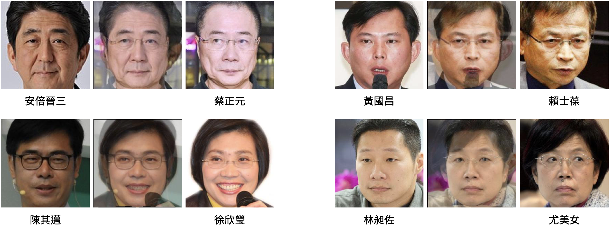

# Face Verification

This repo integrate face detection, aligment and verification with state-of-the-art-models, plus a data augmentation technique inspired by image morphing.

## Method

### Face recognition

Following standard practice, we adopt state-of-the-art models to detect bounding boxes and facial landmarks for face normalization. Then we train ArcFace for face classification.

- Face Detection and Alignment: [RetinaFace](https://github.com/biubug6/Pytorch_Retinaface)
- Face classfication: [ArcFace](https://github.com/deepinsight/insightface)

### Data Augmentation

A data augmentation technique inspired by [SamplePairing](https://arxiv.org/abs/1801.02929) and [RICAP](http://proceedings.mlr.press/v95/takahashi18a.html) is proposed. These two methods augment data by averaging two images or assembing a new image with 4 patches cropped from 4 different images. However, instead of averaging or patching different faces with their pixel values, the true concept of the _average_ of two faces for our brain is that one looks like two other people. Therefore, we can produce a more exquisite _averaging face_ with [image morphing](https://github.com/Azmarie/Face-Morphing) methods, which warp two images to align their feature points, i.e. facial landmarks in our scenario. The following figure shows some examples for the augmented images.



## Execution

The implementation is tested on Asian Politician Dataset (APD). Any image dataset arranged as PyTorch [ImageFolder](https://pytorch.org/vision/stable/datasets.html#imagefolder) format is compatible.

###Quick start

First rename the dataset to `data/` and put it under  `code/`.

Then under `code/`, run the following script to download pretrained RetinaFace and all verification model weights.

```shell
sh download.sh
```

To train a face verifation model with images cropped and aligned by pretrained RetinaFace, run

```
python main.py --mode train
```

To test closed set with the previously trained model, run

```
python main.py --mode closed
```

To test open set with the previously trained model, run

```
python main.py --mode open
```

### Step-by-step

1. **Rename the dataset to `data/` folder**

2. **(Optionally) generate training annotations for RetinaFace**

   Collect all available images to train RetinaFace, and generate bounding boxes and landmarks for these training images with the following command.

   ```bash
   python gen_data_retina.py path/to/training/images/folder \
                             path/to/save/label/file \
                             path/to/save/resized/imges/list \
                             path/to/pretrained/checkpoint 
   ```

   The first argument is the training images folder. The second one is the path to save the generated annotations. The third one is to save a list of file paths of large images, which cannot fit into GPU memory limits and have been resized. The last one is the checkpoint of pretrained RetinaFace.

3. **(Optionally) train RetinaFace**

   Put all training images into `retinaface/data/widerface/train/images` and rename the annotation to `retinaface/data/widerface/train/label.txt`. Then, under `retinaface`, execute

   ```shell
   python train.py
   ```

4. **Generate cropped and aligned faces from pre-trained or my RetinaFace**

   The basic usage is 

   ```bash
   python preprocess.py /path/to/output/dir /path/to/face/detector/checkpoint
   ```

   For example, for pretrained RetinaFace, download the pre-trained weights with `download.sh` and  execute

   ```bash
   python preprocess.py APD2 retinaface/weights/Resnet50_Final.pth 
   ```

   The processed faces are then saved to `train`,  `test/closed_multi`, and `test/open` under `APD2` folder.

   To crop and align faces with RetinaFace trained by myself, execute

   ```bash
   python preprocess.py APD3 retinaface/weights/Resnet50_ours.pth
   ```

5. **Train ArcFace model with cropped and aligned faces**

   ```
   python train.py DATASET
   ```
   
6. **Test on the closed set**

   ```
   python test_closed.py DATASET /path/to/trained/model
   ```

7. **Test on the open set**

   First generate similarities [-1, 1] between test image pairs. This generates a `.npy` in `result/`.

   ```
   python test_open.py DATASET /path/to/trained/model
   ```

   Then calculate the score with a given threshold.

   ```
   python score.py /path/to/result/file THRESHOLD
   ```
   
8. **(Optionally) Generate mixup images**

   Under FaceMorphing, run

   ```
   python average.py /path/to/input /path/to/output
   ```


## Experiments

I evaluate the baseline ArcFace model with face images preprocessed by pretrained RetinaFace and our RetinaFace on APD dataset. The effect of the augmentation is also reported. The following table shows the highest scores in each setting.  (LR = learning rate. THR = threshold. aug = data augmentation.)

|                                          | Closed set (%) | Open set (%)            |
| ---------------------------------------- | -------------- | ----------------------- |
| ArcFace with pretrained RetinaFace       | 88.4 (LR=0.4)  | 84.9 (LR=0.1, THR=0.28) |
| ArcFace with our RetinaFace              | 86.5 (LR=0.4)  | 85.4 (LR=0.4, THR=0.38) |
| ArcFace with pretrained RetinaFace + aug | 88.5 (LR=0.4)  | 86.4 (LR=0.4, THR=0.35) |

